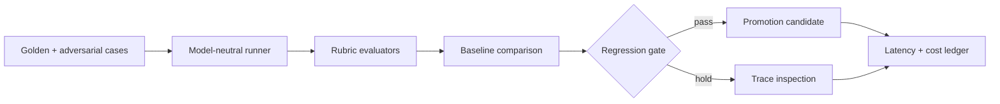

# EvalForge AI

**A model-neutral evaluation and regression workbench for operational AI.**

> All people, organizations, records, measurements, and outcomes in this
> repository are synthetic.


[Open the live demonstration](https://jermaine-anugwom.github.io/evalforge-ai/)

## The operational problem

Teams cannot safely improve an AI workflow when quality, abstention, latency, cost, and regressions are measured inconsistently.

## The proof

Term-based rubrics, required-abstention cases, forbidden-term checks, latency/cost records, and a fail-closed regression gate that requires matching unique case IDs.

The committed fixture set contains 100 category-varied golden cases and 12 distinct adversarial scenarios; test IDs map directly to those records.

## Why this is forward deployed

The project begins with the operator's decision, uncertainty, failure cost,
integration boundary, and handoff—not with a model demo. It makes policy and
evidence inspectable, preserves human authority for consequential cases, and
remains useful when the optional model layer is unavailable.

## Architecture



## Quickstart

```bash
python3.12 -m venv .venv
source .venv/bin/activate
python -m pip install -c constraints.txt -e '.[dev]'
pytest -q
evalforge
```

No API key or network connection is required.

Run the interface and API demonstrations side by side with `docker compose up --build`; the interface is available on port 3001 and the API on port 8001. The visual fixture is intentionally static and does not claim to be API-produced evidence.

## Evaluation and limitations

Run `pytest -q` for the reproducible evaluation. The fixture set is deliberately
synthetic and cannot establish production performance. A real deployment would
require operator observation, representative data, policy review, privacy review,
security testing, and a monitored rollout.

## Project documents

- [Field discovery and handoff](FIELD_NOTES.md)
- [Security boundaries](SECURITY.md)
- [Operating runbook](RUNBOOK.md)
- [Development provenance](DEVELOPMENT.md)
- [Release history](CHANGELOG.md)

## Topics

`ai-evals`, `llmops`, `fastapi`, `nextjs`, `observability`, `testing`
